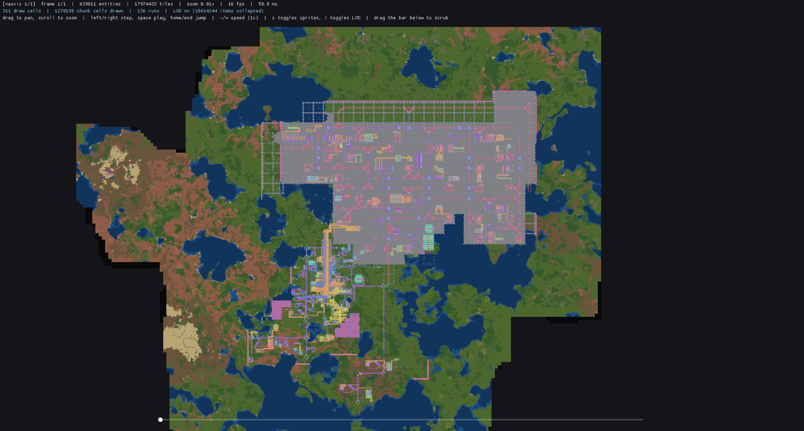
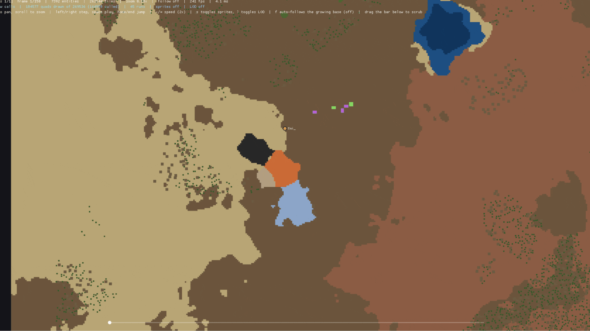
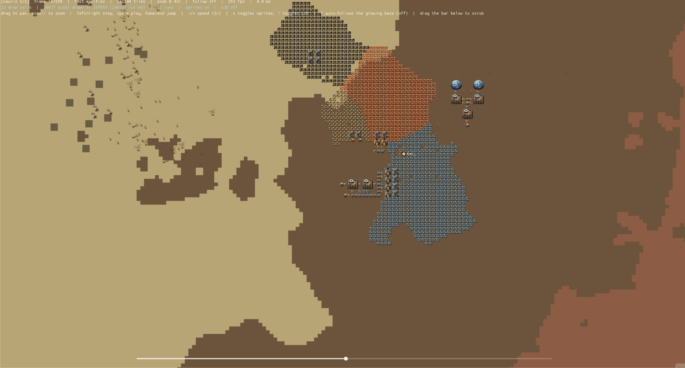
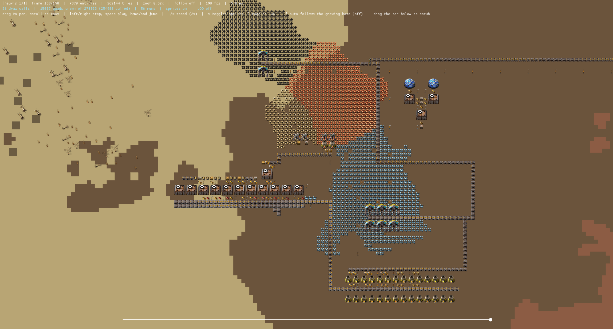

# Save Timelapse
Save Timelapse is a Factorio mod and companion desktop application for creating interactive factory timelapses.

> Build an interactive timelapse of your Factorio factory  from existing saves or while you play.

**Save Timelapse works with saves you already have**. Point it at your save folder, and it reconstructs your factory's history into an interactive replay you can pan, zoom, scrub, and explore.

> ⚠️ **Alpha:** The core pipeline is functional, but the project is under active development. Expect bugs, missing features, and breaking changes between releases.

---

## Features

- 📦 Build timelapses from **existing save files**
- 🎮 Live capture mode with minimal performance impact
- 🎛️ In-game panel to control live capture: start/stop, choose which surfaces are recorded, and reset
- 🗺 Interactive viewer with pan, zoom and timeline scrubbing
- 🌍 Multi-surface support (Nauvis, platforms, planets)
- ⚡ Chunked renderer with automatic level-of-detail rendering
- 🦀 Written in Rust for performance
- 🔧 No Python, command-line tools or FFmpeg required

---

## Why Save Timelapse?

Most Factorio timelapse tools have one major limitation:

> They only start recording after you install them.

Save Timelapse can reconstruct a timelapse from the saves already sitting in your saves folder. If you've kept autosaves or milestone saves, you can build a timelapse of a factory that was created weeks or months ago.

For ongoing factories, enable live capture once and the mod records only incremental changes instead of repeatedly exporting the whole world.

---

## Installation

Two separate downloads, depending on what you want to do.

**The tool** (`save-timelapse.exe` + `viewer.exe`): needed either way, since this is what builds and shows the timelapse.

1. Download the latest release from [GitHub Releases](https://github.com/rephyr/save-timelapse/releases)
2. Unzip `save-timelapse.exe` and `viewer.exe` into the same folder (the first launches the second, so they need to sit together)
3. Run `save-timelapse.exe`

**The mod**: only needed for live capture, not for building a timelapse from saves you already have.

- Get it from the [Factorio mod portal](https://mods.factorio.com/mod/save-timelapse), or install it in-game via Settings > Mods > Install mods
- Enable the `save-timelapse-live-capture` runtime setting to start recording

No changes are made to your Factorio installation or mods folder unless you install the mod yourself.

---

## Screenshots
- Overview of the current state of the tool


- Live capture, played back


- Timeline scrubbing


- Zoomed sprite rendering


- Camera auto-follow gradually zooming out as the base grows


---

## How it works

Save Timelapse supports two workflows.

### Existing saves

The application:

1. Finds your Factorio installation
2. Launches Factorio in headless mode
3. Exports each selected save
4. Reconstructs the world
5. Opens the interactive viewer

It also asks whether to include natural terrain (grass, water, trees,
cliffs) around the base. Worth it for how much more it looks like a real
place, but it's a real cost, not a free improvement: roughly 5x more export
time and file size in testing, so it's an explicit yes/no each run rather
than always on.

No changes are made to your real installation or mod folder.

---

### Live capture

Enable the runtime setting:

```
save-timelapse-live-capture
```

The mod:

- performs one initial snapshot
- records only entity additions/removals afterwards
- keeps runtime overhead minimal
- tags every capture with which playthrough it belongs to, so saves from
  different games never get mixed into one timelapse

Whenever you want to view the replay, simply launch Save Timelapse. If more
than one playthrough has capture data waiting, it asks which one to build
the timelapse from.

Click the Save Timelapse shortcut in the top toolbar (or press
Control+Shift+T) to open the in-game control panel: toggle live capture,
exclude individual surfaces from recording (including planets you haven't
visited yet), or reset capture. Excluding a surface skips its baseline
entirely, not just its ongoing events, so a huge base you don't care about
tracking (a sprawling Nauvis factory, say, while you only want a smaller
Gleba outpost recorded) doesn't cost anything to capture. Checking a box
only records the choice; press **Generate** to actually take a catch-up
baseline for whatever you just included, so ticking several surfaces first
batches into one freeze instead of one per box, without touching any other
surface's already-recorded history. Resetting (behind a confirmation
dialog, since it's permanent) deletes this playthrough's own capture files
and retakes the baseline, so files no longer need to be deleted by hand
first.

> Upgrading from an older version? Run `/timelapse-reset-capture` once
> in-game (or use the panel's reset button) so your current playthrough
> starts a freshly tagged capture.

Terrain works differently here, since save-timelapse.exe only reads a
baseline after the mod already took it, not before: enable the
`save-timelapse-capture-terrain` **startup** setting (off by default, same
reasoning as above) before your baseline is taken if you want it included
in a live capture.

> **Known limitation:** with terrain capture on, removing landfill during
> the tracked playthrough leaves an empty tile in the replay instead of
> reverting to the water underneath. Fixing this properly needs the mod to
> capture what a removed placed-floor tile is replacing at removal time;
> tracked for a future release.

---

## Viewer

Current features:

- Pan
- Zoom
- Timeline scrubbing
- Play / Pause (`-`/`=` adjust speed, 0.25x-8x)
- Home / End navigation
- Surface switching
- Player position marker
- Camera auto-follow (on by default, `f` to toggle off): gradually pans and zooms out to keep the whole base in frame as it grows, the way TLBE's own camera does
- Sprite rendering
- Entity rotation (belts only for now, see the known limitation below)
- Flat-color LOD rendering
- Parallel loading
- Progress indicator

> **Known limitation:** rotation only renders for entities on a small,
> curated allowlist (currently just the transport belt tiers), rather than
> for every entity by default. Most Factorio icons are stylized
> oblique-angle renders (a fixed 3D-ish camera perspective) rather than a
> flat top-down one, so rotating the whole icon just spins that fixed camera
> angle around and looks wrong regardless of the angle used; a belt's icon,
> by contrast, is flat and top-down, so rotating it looks correct. The
> allowlist grows as more entities are checked and confirmed to look right
> rotated. Separately, even an allowlisted entity only rotates if its
> footprint is square: Factorio reports a rotated rectangular entity's
> footprint already swapped for the current direction, with no way to
> recover the original, unrotated dimensions from what's captured, so
> rotating the drawn box on top of that would misalign it from the entity's
> real footprint instead of fixing it.

---

## Building

```bash
cargo build --release
cargo test --workspace
```

The Lua mod requires no build step.

---

## Roadmap

### v0.1

- [x] Existing save export
- [x] Live capture
- [x] Interactive replay
- [x] Timeline scrubbing
- [x] Chunked renderer
- [x] Sprite rendering
- [x] LOD rendering

### v0.2

- [x] Checksums and format versioning
- [x] Adjustable playback speed
- [x] Documentation, screenshots, and GIFs
- [x] Terrain and terrain-scatter rendering
- [x] Player position tracking
- [x] Camera auto-follow

### v0.3

- [x] Terrain capture optimization
- [x] Entity rotation tracking
- [x] Robust capture recovery and diagnostics
- [x] In-game live capture control panel
- [x] Safer capture reset
- [x] Per-surface capture selection
- [x] Mid-playthrough surface baselines
- [x] Improved baseline warnings

### v0.4

- [ ] Timeline timestamps and hover information
- [ ] Milestones, bookmarks, and event indicators
- [ ] Better timeline navigation

### v0.5

- [ ] First-run setup
- [ ] Capture management
- [ ] Persistent settings and preferences
- [ ] Complete tile change tracking
- [ ] Polished Windows packaging

### v1.0

- [ ] Broader modded-game compatibility
- [ ] Smarter camera auto-follow
- [ ] Camera keyframes and cinematic controls
- [ ] Export resolution and FPS controls
- [ ] MP4 video export
- [ ] Polished export workflow
- [ ] Stable capture format and format migration

---

## Architecture

```
Factorio Save
        │
        ▼
 Lua Export Mod
        │
        ▼
 Binary Snapshot + Event Log
        │
        ▼
 Replay Engine (Rust)
        │
        ▼
 Interactive Renderer
```

More details are available in [docs/ARCHITECTURE.md](docs/ARCHITECTURE.md).

---

## Contributing

Issues, bug reports and feature suggestions are welcome.

---

## License

MIT
